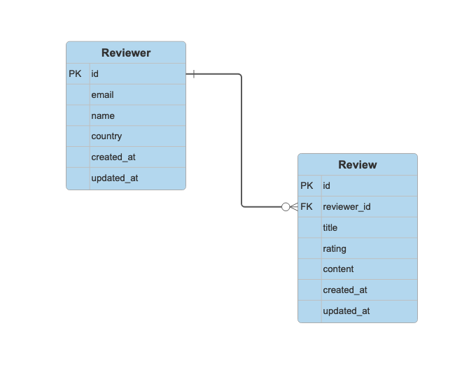

# Design Doc

## Introduction

### Overview

Design for an API that allows CRUD operations to be performed on Trustpilot Review dataset.

### Background

The objective is to build an API as an interface to a database containing the Trustpilot Review dataset. The API needs to allow business users to perform CRUD operations on the dataset.

As a take home-task, this will be a toy application akin to a Proof of Concept. The code should be written to a production standard, but the application will not be production ready. There should be a route to production that doesn't require significant code or architecutre changes.

### Assumptions

The design has been built on the basis of the following assumptions. These have been made without consultation as this is a take home test with limited requirement details and no opportunity to get clarity.

- Use cases for the API are transactional in nature - with only the current state required
- API is for business users only
- The API is expected to return all the data including any Personally Identifiable Information (PII) fields
- The CSV data is only for initial population of the database and the ability to update the database from CSVs is not a required feature
- Despite the [sample data](../data/dataops_tp_reviews.csv) being very small, it is assumed to be a representation of the data the system should handle
- All reviews must be made by a legitimate user, so must have a valid email address

### Out of Scope

- Deployment or having the application fully production ready
- Detection and handling of PII in free text fields
- Advanced user authentication or role-based access control

## Solution

### Functional Design

#### Data Notes

- The data is UTF-8 encoded
- All reviews (content and titles) are in English
- "Review Content" column can contain emojis
- PII columns and other free text columns with PII risk, see [PII section](#personally-identifiable-information) for more details
- Not all emails in "Email Address" column are valid
- "Review Rating" is on a scale between 1 & 5
- "Country" column has a mix of country names and codes (which are not [ISO 3166](https://en.wikipedia.org/wiki/List_of_ISO_3166_country_codes) compliant)

#### Data Pipeline

As CSV data is just for initial population of the database, the ingestion will be run as part API container startup. Once the API is instantiated, all changes to the database should be done via the API.

Functionality:

1. Check if email field is valid email address
    - Pydantic email type can be used for validation

    - If the email is not valid email then the row should not be loaded into the database. Each user should have a unique email address and not having a valid email establishes issues regarding review legitimacy. If this is an issue then email validation should be implemented at the collection point for the data.

1. Convert emojis to text
    - Look at using [emoji Python package](https://carpedm20.github.io/emoji/docs) - the `emoji.demojize` method that will convert unicode emoji in a string with emoji shortcodes, eg. `"😊"` to `":smile:"`

    - API users would then be responsible for converting from shortcode back to unicode emoji if required. This is something that can be done in most languages.

    - emoji package supports the entire set of Emoji codes as defined by the [Unicode consortium](https://unicode.org/emoji/charts/full-emoji-list.html), so the risk that it will not be able to handle an emoji is low.

    - Example of emoji:

      ```python
      import emoji
      emoji_text = [
          "Fun text and thumbs up. 👍",
          "❌ Negative text and multi emojis... 😡",
          "Nothing more than a tick... ✔️",
          "Lots more emojis.... 📧  ⏳  📦  🤷‍♀️  📏  🙌  💰  🛑",
          "Boring old text with not fun emojis",
      ]

      for text in emoji_text:
          print(emoji.demojize(text))
      ```

1. Convert country field to ISO-3166 three-letter country code ([ISO-3166 alpha-3](https://en.wikipedia.org/wiki/ISO_3166-1_alpha-3))
    - Look at using [pycountry Python package](https://github.com/pycountry/pycountry?tab=readme-ov-file#pycountry) - `pycountry.countries` has a `search_fuzzy` method that will return a Country object from a valid name or code

    - `UK` is not the ISO-3166 country code for the United Kingdom (it's `GB` or `GBR`). To make sure UK is correctly identified as United Kingdom need to update the United Kingdom's entry to include an alt code `pycountry.countries.add_entry(alt_code="UK", alpha_2='GB', alpha_3='GBR', flag='🇬🇧', name='United Kingdom', numeric='826', official_name='United Kingdom of Great Britain and Northern Ireland')`

    - There is a risk that the fuzzy search will return the incorrect country. For example [known issue](https://github.com/pycountry/pycountry/issues/115) with Nigeria ranked over Niger when searching for "Niger". It works for all counties in the sample data and this can be re-evaluated prior to productionisation.

    - Example of pycountry:

      ```python
      from pycountry import countries
      countries_list = ["USA", "UK", "Canada", "Australia", "Germany", "France", "Spain"]

      countries.add_entry(alt_code="UK", alpha_2='GB', alpha_3='GBR', flag='🇬🇧', name='United Kingdom', numeric='826', official_name='United Kingdom of Great Britain and Northern Ireland')
      for country in countries_list:
          matched_countries = countries.search_fuzzy(country)
          print(country, "  ---  ", matched_countries[0].alpha_3)
      ```

    - Alternatives Options:
    -- [country-converter Python package](https://github.com/IndEcol/country_converter?tab=readme-ov-file#country-converter) - Has a dependency on Pandas so is going to be much larger

#### Data Store

For simplicity will use an embedded database stored locally within API container. As this is a transactional system, will use [SQLite](https://www.sqlite.org/).

Embedded databases, of with SQLite is the OG, are a good fit for smaller business applications, especially early on in a project. SQLite can and is [used in production](https://www.sqlite.org/whentouse.html) and while it's architecture means it will always have scalability limitations, it can handle reasonable scale. A client-server database, like PostgreSQL, will be be a better fit suited for uses with high write throughput, high concurrency, very large dataset (SQLite has a size limit of 281TBs). SQLite's limitations will be more than sufficient to this application.

Use SQLite [Write-Ahead Logging](https://www.sqlite.org/wal.html) (WAL) mode as it allows multiple readers to co-exist with a single writer. Ordinarily, when one connection is holding the write lock, no other connection can write or read until the lock is released. WAL-mode relaxes these restrictions by allowing readers to operate while another connection writes to the database.

Ingestion and API will use an Object Relational Mapper (ORM), so switching to a different database running on an external server in the future will be straightforward and require minimal code changes.

##### Data Model

The data contains two clear entities Reviewer and Review, which has a one-to-many relationship.



###### Reviewer Table

| Column Name | Type | PII | Notes |
|-------------|------|-----|-------|
| id | INTEGER | False | Primary Key |
| email | TEXT | True | Unique |
| name | TEXT | True |  |
| country | TEXT | False | ISO-3166 country code |
| created_at | TIMESTAMP | False | Nullable |
| updated_at | TIMESTAMP | False | Nullable, default NULL |

###### Review Table

| Column Name | Type | PII | Notes |
|-------------|------|-----|-------|
| id | INTEGER | False | Primary Key |
| reviewer_id | INTEGER | False | Foreign key (Reviewer) |
| title | TEXT | False | Free text field |
| rating | INTEGER | False | Between 1 & 5 |
| content | TEXT | False | Free text field |
| created_at | TIMESTAMP | False | |
| updated_at | TIMESTAMP | False | Nullable, default NULL|

#### API

API paths should map to the data model, with `/reviewers` and `/reviews`

##### Reviewers

###### GET `/reviewers`

- Verb: `GET`
- Path: `/reviewers`
- Description: Get all reviewers
- Pagination: Page-based pagination
- Query Parameters
  - `country`
    - Filter reviewers from a specific country, using valid [ISO 3166 three letter country code](https://en.wikipedia.org/wiki/ISO_3166-1_alpha-3)
    - Optional array (string)
    - Example: `?country=aus`
  - `perPage`
    - The number of results per page (max 100)
    - Optional int, default 30. Minimum 1 & Maximum 100
    - Example: `?perPage=50`
  - `page`
    - The page number of the results to fetch
    - Optional int, default 1. Minimum 1
    - Example: `?page=2`
- Example Response:
  Status: `200`

  ```json
  {
    [
      {
        "id": 42,
        "email": "arthur.dent@space.com",
        "name": "Arthur Philip Dent",
        "country": "GBR"
      },
      {
        "id": 43,
        "email": "fordprefect@betelgeusian.xxx",
        "name": "Ford Prefect",
        "country": "ESP"
      }
    ]
  "total": 2,
  "next_page": null,
  "previous_page" null
  }
  ```

###### POST `/reviewers`

- Verb: `POST`
- Path: `/reviewers`
- Description: Create a new reviewer
- Example Response:
  Status: `201`

  ```json
  {
    "id": 42,
    "email": "arthur.dent@space.com",
    "name": "Arthur Philip Dent",
    "country": "GBR"
  }
  ```

- Errors:
  - All reviewers must have unique email address, so if email address already exists in database return status code `409`

###### GET `/reviewers/{id}`

- Verb: `GET`
- Path: `/reviewers/{id}`
- Description: Get the reviewer by id
- Example Response:
  Status: `200`

  ```json
  {
    "id": 42,
    "email": "arthur.dent@space.com",
    "name": "Arthur Philip Dent",
    "country": "GBR"
  }
  ```

###### PATCH `/reviewers/{id}`

- Verb: `PATCH`
- Path: `/reviewers/{id}`
- Description: Update the reviewer by id
- Example Response:
  Status: `200`

  ```json
  {
    "id": 42,
    "email": "arthur.dent@space.com",
    "name": "Arthur Philip Dent",
    "country": "GBR"
  }
  ```

###### DELETE `/reviewers/{id}`

- Verb: `DELETE`
- Path: `/reviewers/{id}`
- Description: Delete the reviewer by id
- Example Response:
  Status: `204`
- Errors:
  - If the reviewer has reviews in the review table then it should not be deleted. A `409` status code should be returned with explanatory error message

##### Reviews

###### GET `/reviews`

- Verb: `GET`
- Path: `/reviews`
- Description: Get all reviews
- Pagination: Page-based pagination
- Query Parameters:
  - `rating`
    - Filter reviews by there rating. Either by providing exact rating value or by providing a valid operator followed by a rating value. Valid operators are `eq:`, `gt:`, `gte:`, `lt:` and `lte:`.
    - Optional string, matching the pattern `^((eq|gte?|lte?):)?[1-5]$`
    - Example: `?rating=3` or `?rating=gte:3`
  - `date`
    - Filter reviews by there date. Either by providing exact date value or by providing a valid operator followed by a rating value. This is a date in [ISO 8601](https://en.wikipedia.org/wiki/ISO_8601) format: `YYYY-MM-DD`. Valid operators are `eq:`, `gt:`, `gte:`, `lt:` and `lte:`. To filter for a specific date range, provide multiple parameters, one using `gt`/`gte` operator and the other using `lt`/`lte` operator.
    - Optional array (strings), matching the pattern `^((eq|gte?|lte?):)?(19|20)\d{2}-(0[1-9]|1[0,1,2])-(0[1-9]|[12][0-9]|3[01])$`
    - Example: `?date=2024-01-01` or `?date=ge:2024-06-14` or `?date=gte:2024-01-01&date=lte:2024-12-31`
  - `reviewerId`
    - Filter reviews by a specific user.
    - Optional int
    - Example: `?reviewerId=44`
  - `orderBy`
    - The order the reviews should be ordered by. Must be either `asc:` or `desc:` followed by one of the returned keys. If multiple orderBy parameters are provided, the results will be ordered according to the order of the parameters.
    - Optional array  (strings) , matching the pattern `^(asc|desc):\w+$`
    Default: `?orderBy=desc:date&orderBy=desc:rating`
    - Example: `?orderBy=asc:rating` or `?orderBy=asc:rating&orderBy=desc:date`
  - `perPage`
    - The number of results per page (max 100)
    - Optional int, default 30. Minimum 1 & Maximum 100
    - Example: `?perPage=50`
  - `page`
    - The page number of the results to fetch
    - Optional int, default 1. Minimum 1
    - Example: `?page=2`
- Example Response:
  Status: `200`

  ```json
  {
    [
      {
        "id": 99,
        "reviewerId": 200,
        "title": "A Dream Come True",
        "rating": 5,
        "content": "I woke up this morning and my wildest dream was real",
        "created_at": "2025-01-01T01:01:01"
      },
      {
        "id": 100,
        "reviewerId": 88,
        "title": "Nothing Nice 2 Say",
        "rating": 1,
        "content": "If you have nothing nice to say, say nothing!!",
        "created_at": "2025-01-01T02:02:02"
      }
    ]
    "total": 2,
    "next_page": null,
    "previous_page" null
  }
  ```

###### POST `/reviews`

- Verb: `POST`
- Path: `/reviews`
- Description: Create a new review
- Example Response:
  Status: `201`

  ```json
  {
    "id": 99,
    "reviewerId": 200,
    "title": "A Dream Come True",
    "rating": 5,
    "content": "I woke up this morning and my wildest dream was real",
    "created_at": "2025-01-01T01:01:01"
  }
  ```

###### GET `/reviews/{id}`

- Verb: `GET`
- Path: `/reviews/{id}`
- Description: Get the review by id
- Example Response:
  Status: `200`

  ```json
  {
    "id": 99,
    "reviewerId": 200,
    "title": "A Dream Come True",
    "rating": 5,
    "content": "I woke up this morning and my wildest dream was real",
    "created_at": "2025-01-01T01:01:01"
  }
  ```

###### PATCH `/reviews/{id}`

- Verb: `PATCH`
- Path: `/reviews/{id}`
- Description: Update the review by id
- Example Response:
  Status: `200`

  ```json
  {
    "id": 99,
    "reviewerId": 200,
    "title": "A Dream Come True",
    "rating": 5,
    "content": "I woke up this morning and my wildest dream was real",
    "created_at": "2025-01-01T01:01:01"
  }
  ```

###### DELETE `/reviews/{id}`

- Verb: `DELETE`
- Path: `/reviews/{id}`
- Description: Delete the review by id
- Example Response:
  Status: `204`

### Non-Functional Design

#### Personally Identifiable Information

The reviewer table and CSV file for initial population of database contain the following PII columns:

- `reviewer.name` ("Reviewer Name" in CSV)
- `reviewer.email` ("Email Address" in CSV)
- `reviewer.country` ("Country" in CSV)

If the `reviewer.name` and `reviewer.email` columns are encrypted in the database, then `reviewer.country` would be pseudo-anonymised and could remain in plain text.

Additionally the following columns in the review table (and CSV file) are free text columns and so could contain PII.

- `review.title` ("Review Title" in CSV)
- `review.content` ("Review Content" in CSV)

While this is a risk, handling this is out of the current scope, see [Future Improvements and Optimisations](#future-improvements-and-optimisations) for details on how this could be managed.

SQLite doesn't have any column level encryptions functions, but does support the encryption of the whole database file. Will use [SQLCipher](https://github.com/sqlcipher/sqlcipher?tab=readme-ov-file#sqlcipher), which adds 256 bit AES encryption of database files and other security features. The database file will be encrypted and a key will be required to read the data.

Encryption and decryption could be managed in the application layer, but as the API is expected to return the data with PII this would add additional performance overhead with little additional security benefit. Ensuring strong [Authn](#authentication) and [Authz](#authorization) implementation and process for granting them will add more security benefits than column level encryption at this stage.

#### Authentication

Start with a simple API key-based authentication approach. Users will pass there api key as a header (`x-api-key`).

See [Future Improvements and Optimisations](#future-improvements-and-optimisations) for a more robust token based approach.

#### Authorization

Currently the api has no gradual authorization or RBAC controls. If a user has access to the API then they have full read & write permissions.

#### Monitoring & Alerting

As a toy application, beyond logging no monitoring or alerting will be implemented.

## Further Considerations

### Future Improvements and Optimisations

Below are a number of areas in which the API could be improved, though whether or not they should be implamed would depend on future requirements.

- **Authentication**: Replace API key authn, with a more robust OAuth2 or JWT token approach

- **Authorization**: Implement different permission levels. Separate out read, write and delete permissions. Also add PII (see PII in plain text) & Non-PII read permissions (see deterministically encrypted PII values); have Non-PII read permission as default. Once using 0Auth, then could look at using scopes.

- **Observability**: Add OpenTelemetry middleware for trace collection, that could then be exported to any OpenTelemetry compliant systems like Prometheus or Elastic.

- **PII Handling**: Detecting and handling any PII in free text fields. [Microsoft Presidion](https://microsoft.github.io/presidio/) could be intergrated as FastAPI middleware to handle detectiona and anonymisation.

- **API Security**: Add rate limiting

- **Disaster Recovery**: [LiteFS](https://fly.io/docs/litefs/) can be used to backup the database and can be used to reconstruct the state of our SQLite database at any point in time, as well as being able to copy changes to another nodes in order to replicate the changes in real-time to our cluster.
A more simple alternative would be to use [Litestream](https://litestream.io/), which is designed to just replicate database to object store (like S3).
For just DR litestream is probably better option, but LiteFS is much more than just DR and allows a scale-out model for SQLite.

- **Data Lake Loading**: DuckDB (OLAT embedded database) can [directly query SQLite files](https://duckdb.org/docs/guides/database_integration/sqlite.html). Litestream/LiteFS could be used to replicate the database and DuckDB would then able to read the data and either analize it or loading it into a Datawarehouse or Data Lake (or even a Data Lakehouse!!!) with it's extensive support of the ecosystem.

- **Functionality**: Add a reviewers sub route, so you can get a user and all of there reviews in the same api call. Something like `/reviewers/{id}/reviews`

- **Performance**: Run load testing to identify performance issues and look at options to mitigate these

- **Performance**: SQLCipher can use a [raw key rather than a passphrase](https://www.zetetic.net/sqlcipher/sqlcipher-api/#PRAGMA_key). A raw key is an exact byte sequence using a blob literal and means that SQLCipher does not have to generate the encryption key. This can give significant performance improvements for small requests.

- **Functionality**: Implament and test multi-language support for review text fields, with tests

- **Database Migration-**: Configure [Alembic](https://alembic.sqlalchemy.org/en/latest/) for handling database migrations
